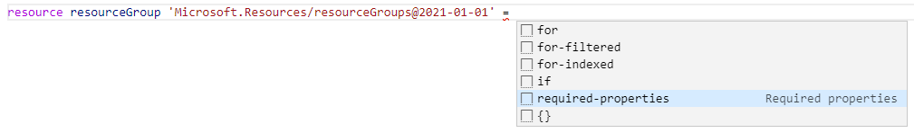

# Bicep

This demo showcases how you can create an Azure PaaS solution with Bicep.

MUST HAVE
- Update documentation

SHOULD HAVE
- Dynamic name for app service via output

## Prerequisites

* Have Azure CLI installed
* Visual Studio Extension for Bicep language support
* Install Bicep

```
az bicep install
```


## Create  bicep file

* Create an `infra.bicep` file 

* Open in Visual Studio Code

* Use often `Ctrl + Space` to get some intellisense

* Configure the targetScope

```
targetScope = 'subscription'
```

## Configure parameters

```
/* ########################################## Parameters ########################################### */
@maxLength(5)
@description('Provide customer or project abbreviation')
param resourcePrefix string = 'noest'
@maxLength(3)
@description('Provide environment abbreviation')
param env string
@description('Provide application name')
param applicationName string = 'flight-info'
@description('Provide SKU for storage account')
@allowed([
  'Standard_LRS'
  'Standard_GRS'
  'Standard_RAGRS'
  'Standard_ZRS'
  'Premium_LRS'
  'Premium_ZRS'
  'Standard_GZRS'
  'Standard_RAGZRS'
])
param storageAccountSku string
@description('Provide SKU for app service plan')
@allowed([
  'F1'
  'D1'
  'B1'
  'B2'
  'B3'
  'S1'
  'S2'
  'S3'
  'P1v2'
  'P2v2'
  'P3v2'
  'P1v3'
  'P2v3'
  'P3v3'
  'I1'
  'I2'
  'I3'
  'I1v2'
  'I2v2'
  'I3v2'
])
param appServicePlanSku string
@allowed([
  'westeurope'
  'northeurope'
])
@description('Provide location for all resources')
param location string = 'westeurope'
@description('Provide unique identifier for release')
param releaseId string = newGuid()
```

## Configure variables

```
/* ########################################## Variables ############################################ */

var prefix = '${resourcePrefix}-${env}-${applicationName}'
var resourceGroupName = '${prefix}-rg'
var appServiceName = '${prefix}-app'
var appServicePlanName = '${prefix}-app-plan'
var storageAccountName = '${replace(prefix, '-', '')}st'
var keyVaultName = '${prefix}-vault'
var storageAccountConnectionStringSecretName = '${storageAccountName}-connectionstring'
var blobContainers = [
  {
    name: 'manuals'
    enablePublicAccess: true
  }
  {
    name: 'tickets'
    enablePublicAccess: false
  }
]
```

## Configure resource group

* Create a resource group with the `required properties` intellisense



* Complete like this

```
/* ########################################## Resources ############################################ */

//Describe Resource Group
resource resourceGroup 'Microsoft.Resources/resourceGroups@2021-04-01'  = {
  name: resourceGroupName
  location: location
  tags: {
    environment: environment
    application: applicationName
    owner: 'toon.vanhoutte@noest.it'
  }
}
````

## Deploy the template

* Open PowerShell

* Login with Azure CLi and select the right subscription

```cli
az logout
az login --tenant <tenant-id>
az account set --subscription <subscription-id>
cd infra
```

* Deploy the Bicep template without passing parameters

```cli
az deployment sub create --location 'westeurope' --template-file infra.bicep
```

* Provide the mandatory parameters inline:
    * **env:** dev
    * **storageAccountSku:** Standard_LRS
    * **appServicePlanSku:** F1


* Deploy the Bicep template with inline **incorrect** parameters

```cli
az deployment sub create --location 'westeurope' --template-file infra.bicep --parameters env=develop 
```

* Deploy the Bicep template with inline **correct** parameters

```cli
az deployment sub create --location 'westeurope' --template-file infra.bicep --parameters env=dev storageAccountSku=Standard_LRS appServicePlanSku=F1
```

* Create an ARM parameter file `infra.parameters.dev.json`

```json
{
  "$schema": "https://schema.management.azure.com/schemas/2019-04-01/deploymentParameters.json#",
  "contentVersion": "1.0.0.0",
  "parameters": {
  "env": {
      "value": "dev"
  },
  "storageAccountSku": {
      "value": "Standard_LRS"
  },
  "appServicePlanSku": {
      "value": "F1"
  },
  "location": {
      "value": "westeurope"
      }
  }
}
```

* Deploy the Bicep template with the parameter file

```cli
az deployment sub create --location 'westeurope' --template-file infra.bicep --parameters ./infra.parameters.dev.json 
```

## Create Storage Account

* Create new module in `modules` subfolder, named `storageaccount.bicep`
  * This showcases loop
  * This showcases parents
  * This showcases outputs

```
param name string
param sku string
param location string
param blobContainers array

resource storageAccount 'Microsoft.Storage/storageAccounts@2021-06-01' = {
  name: name
  location: location
  sku: {
    name: sku
  }
  kind: 'StorageV2' 
}

resource blobService 'Microsoft.Storage/storageAccounts/blobServices@2021-06-01' = {
  name:  'default'
  parent: storageAccount
  resource containers 'containers' = [for container in blobContainers: {
    name: container.name
    properties: {
      publicAccess: (container.enablePublicAccess) ? 'Container' : 'None'
    }
  }]
}
```

* Consume this module from within the `infra.bicep` file

```
//Describe Storage Account
module storageAccount 'modules/storageaccount.bicep' = {
  scope: resourceGroup
  name: 'storageAccount-${releaseId}'
  params: {
    name: storageAccountName
    sku: storageAccountSku    
    blobContainers: blobContainers
    location: location
  }
}
```

## Create Key Vault

* Create new module in `modules` subfolder, named `keyvault.bicep`
  * This showcases loops for secure secrets via dictionary

```
param name string
@secure()
param secrets object = {}
param location string

//Describe Key Vault
resource keyVault 'Microsoft.KeyVault/vaults@2019-09-01' = {
  name: name
  location: location
  properties: {
    enableRbacAuthorization: true
    enableSoftDelete: false
    tenantId: subscription().tenantId
    accessPolicies: [
    ]
    sku: {
      name: 'standard'
      family: 'A'
    }
  }
}

//Describe Key Vault Secrets
resource keyVaultSecrets 'Microsoft.KeyVault/vaults/secrets@2021-10-01' = [for secret in items(secrets):{
  name: secret.key
  parent: keyVault
  properties: {
    value: secret.value
  }
}]
```

* Consume this module from within the `infra.bicep` file

```
//Describe Key Vault
module keyVault 'modules/keyvault.bicep' = {
  scope: resourceGroup
  name: 'keyVault-${releaseId}'
  params: {
    location: location
    name: keyVaultName
    secrets: {
      '${storageAccountConnectionStringSecretName}' : 'DefaultEndpointsProtocol=https;AccountName=${storageAccount.name};AccountKey=${listKeys('${resourceGroup.id}/providers/Microsoft.Storage/storageAccounts/${storageAccount.name}','2019-06-01').keys[0].value};EndpointSuffix=${environment().suffixes.storage}'
    }
  }
}
```

## Create App Service

* Create new module in `modules` subfolder, named `appservice.bicep`
  * This showcases loops
  * This showcases explicit references
  * This showcases conditional properties

```
param name string
param planName string
param planSku string
param appSettings array
param location string

//Describe App Service Plan
resource appServicePlan 'Microsoft.Web/serverfarms@2021-02-01' = {
  name: planName
  location: location
  sku: {
    name: planSku
  }
}

//Describe App Service
resource appService 'Microsoft.Web/sites@2018-11-01' = {
  name: name
  location: location
  properties: {
    serverFarmId: appServicePlan.id
    siteConfig: {
      alwaysOn: (planSku == 'F1' || planSku == 'D1') ? null : true
      appSettings: [for appSetting in appSettings: {
        name: appSetting.name
        value: appSetting.value
      }]
    }
  }
}
```

* Consume this module from within the `infra.bicep` file

```
//Describe App Service
module appService 'modules/appservice.bicep' = {
  scope: resourceGroup
  name: 'appService-${releaseId}'
  params: {
    name: appServiceName
    planName: appServicePlanName
    planSku: appServicePlanSku
    appSettings: [
      {
        name: 'BLOB_CONNECTIONSTRING'
        value: '@Microsoft.KeyVault(SecretUri=https://${keyVault.name}${environment().suffixes.keyvaultDns}/secrets/${storageAccountConnectionStringSecretName}/)'
      }
    ]
    location: location
  }
}
```

* Visualize the Bicep file via `F1 > bicep: Open Visualizer `
